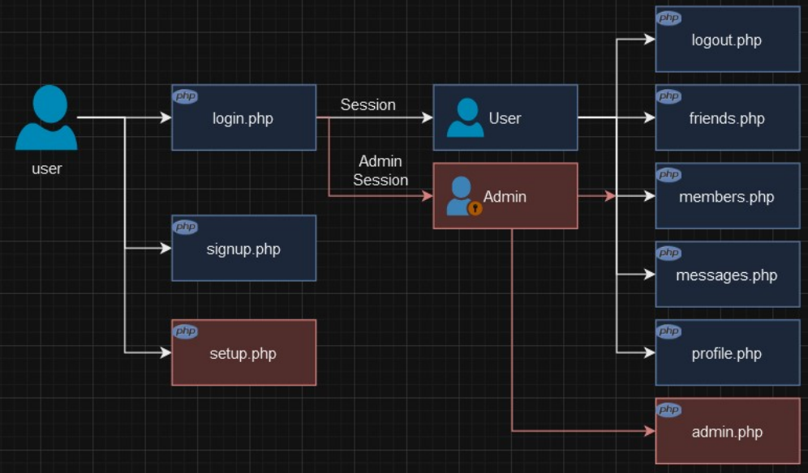
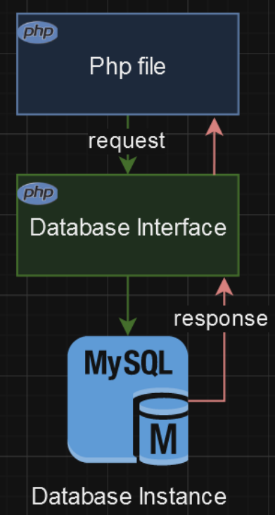
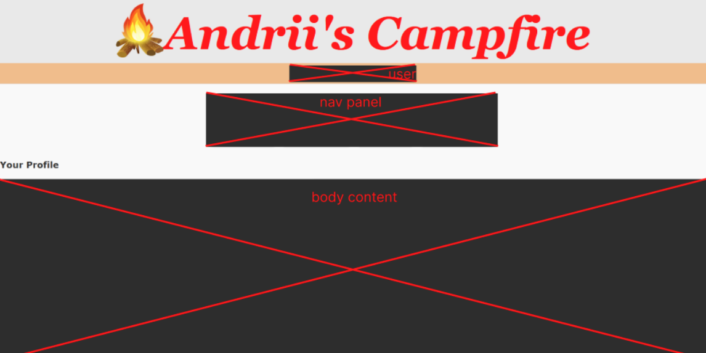
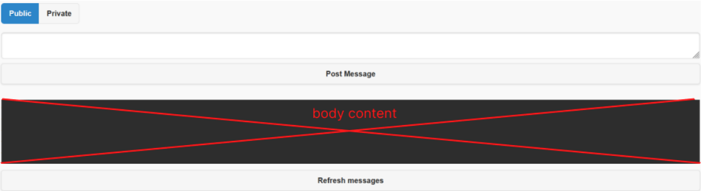
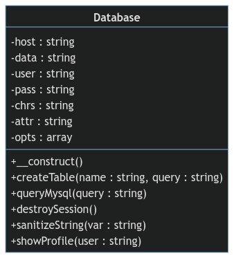
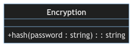
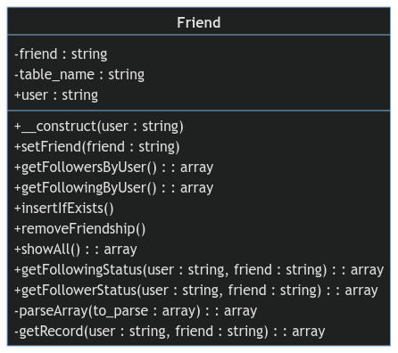
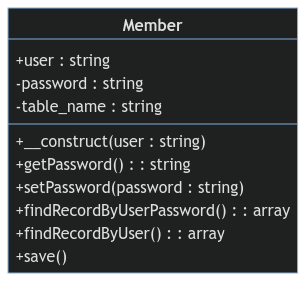
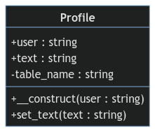

# CSM-System: Social Network "Andrii Campfire"

# Table of contents
1. TODO
2. TODO

# Intro
## Description
Status: `FINISHED and ARCHIVED`

The purpose of the project is to demostrate my web knowledge and create a social network from scratch without frameworks.

## Stack of technologies
LAMP Stack (Linux, Apache, MySQL, PHP):
[](https://skillicons.dev)

# Arhitecture
## Application arhitecture


## Interaction with database



# Development
## Project summary
### Client side summary
* **HTML**: This markup language is used to create the user interface of a web application.
* **CSS**: This cascading style sheets language is used to style the user interface of a web application.
* **JavaScript**: This programming language is used to provide dynamic behavior to the user interface and handle client-side events.
* **PHP**: This programming language is used to handle user requests on the server side and interact with the database.

### Server side summary
* **PHP:** This programming language is used to handle user requests, interact with the database, and generate dynamic HTML pages.
* **MySQL:** This relational database management system is used to store user data, messages, profiles, and other web application data.

### Workflow summary
* The user interacts with the web application through the HTML interface.
* JavaScript is used to handle client-side events and send PHP requests to the server.
* PHP scripts on the server process requests, interact with the MySQL database, and generate dynamic HTML pages.
* The dynamic HTML pages are sent back to the user for display in their browser.

### Project Pros
* This architecture is simple and easy to understand.
* It is easy to expand and maintain.
* It can be implemented using widely available technologies.

### Project Cons
* This architecture may not be as scalable as other architectures.
* It may be more difficult to secure against attacks.

### Possible improvements
* Use a PHP framework, such as Laravel or Symfony, to simplify the development and maintenance of the web application.
* Protect the web application from SQL injection vulnerabilities and other security threats.
* Perform regular database backups.
* Scale the web application as it grows, if necessary.

## Design
To ensure the best user experience in the early stages of development, a decision was made to create a minimalist design with a neutral color palette.

Main page:


Input buttons:


## Database
### Tables
**Table `members`:**
* `user` (VARCHAR): Unique user identifier.
* `pass` (VARCHAR): User password.

**Table `messages`:**
* `id` (INT): Unique message identifier.
* `auth` (VARCHAR): Identifier of the user who sent the message.
* `recip` (VARCHAR): Identifier of the user to whom the message is addressed.
* `pm` (CHAR): Indicates whether the message is private (`pm = 'Y'`) or public (`pm = 'N'`).
* `time` (INT): Time the message was sent.
* `message` (VARCHAR): Message text.

**Table `friends`:**
* `user` (VARCHAR): User identifier.
* `friend` (VARCHAR): User's friend identifier.

**Table `profiles`:**
* `user` (VARCHAR): User identifier.
* `text` (VARCHAR): Additional information about the user (e.g., self-description, interests).

### Relationships
* Each table is linked to the `members` table through the `user` field. This means that every record in the `messages`, `friends`, or `profiles` tables must also have a corresponding record in the `members` table.
* The `messages` table has two relationships with the `members` table:
  * `auth` links each message to the user who sent it.
  * `recip` links each message to the user to whom it is addressed.
* The `friends` table has two relationships with the `members` table:
  * `user` links each friendship record to the user.
  * `friend` links each friendship record to the user's friend.
* The `profiles` table has one relationship with the `members` table:
  * `user` links each user profile to the corresponding user.

### General Overview

* This database structure is suitable for a small social network.
* It allows storing information about users, their messages, friends, and profiles.
* The relationships between tables ensure efficient data access and processing.

### Possible Improvements

* Add a `timestamp` field to the `members` table to store the date and time of account creation.
* Add a `status` field to the `profiles` table to store the user’s status (e.g., active, inactive).
* Add indexes to the `user`, `auth`, `recip`, and `friend` fields to improve query performance.


## Repository structure
```
├───css
├───images
│   ├───icons-png
│   └───icons-svg
├───js
├───mermaind
│   └───png
├───README-assets
└───src
```
* `css` - CSS files
* `images` - all images, including icons
* `js` - JavaScript files
* `mermaind` - Diagram descriptions using Mermaind.js
  * `png` - Exports as PNG files
* `README-assets` - All assets related to this README.md file
* `src` - Class declarations


# Schemes of the classes

## Database


## Encryption


## Friend


## Member


## Profile



