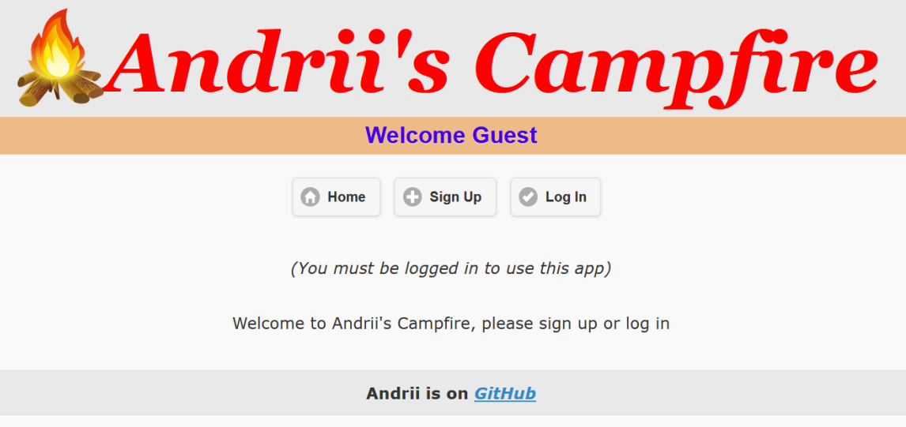
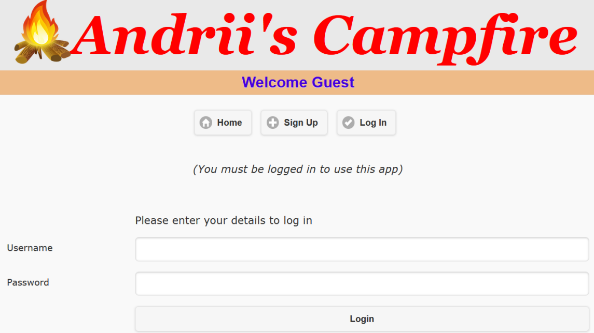
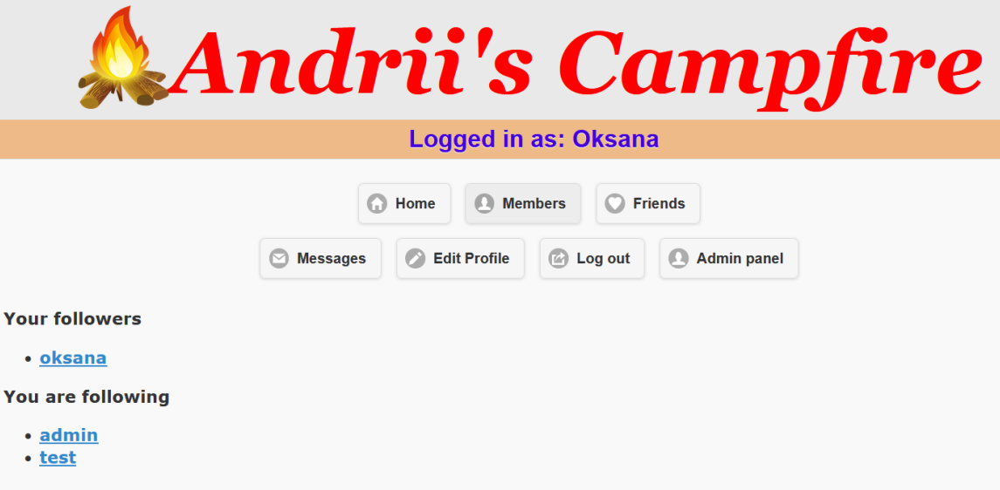
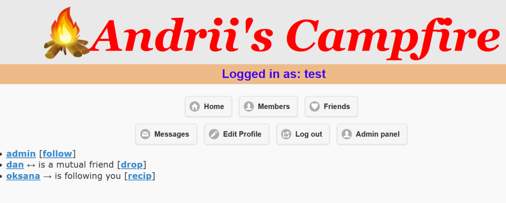
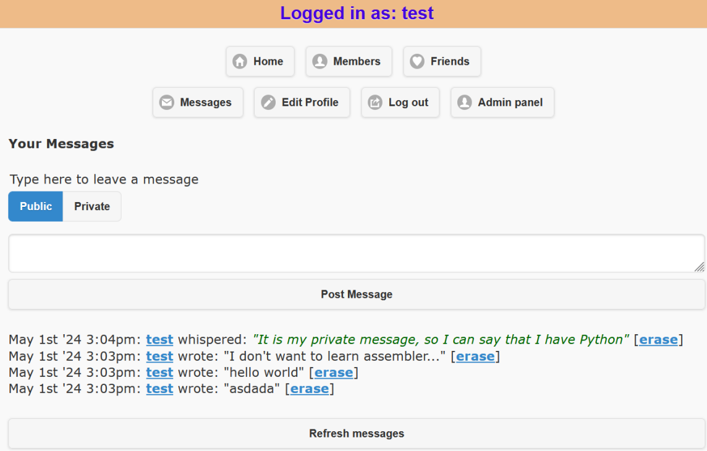
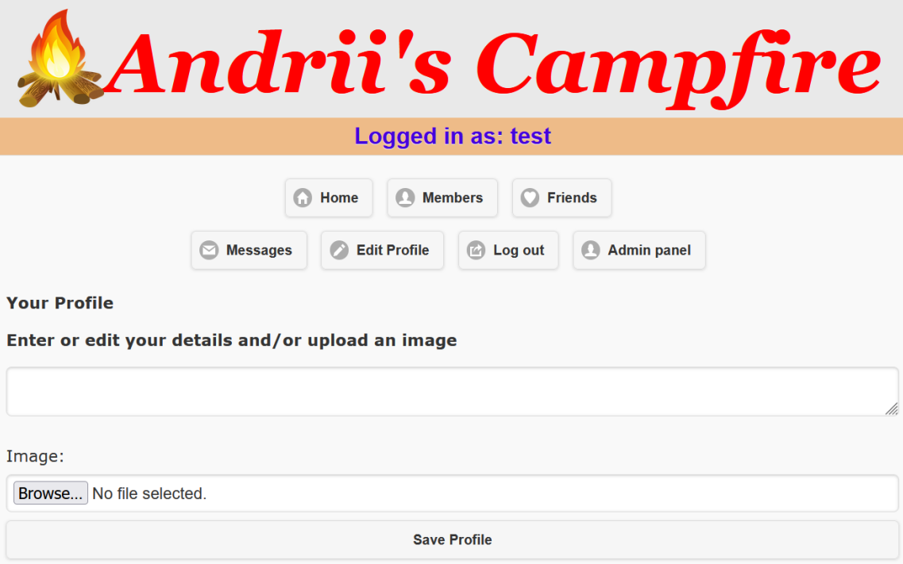
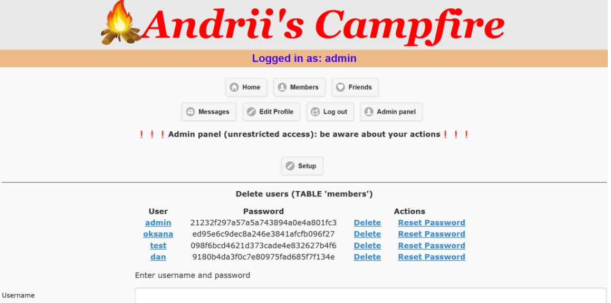
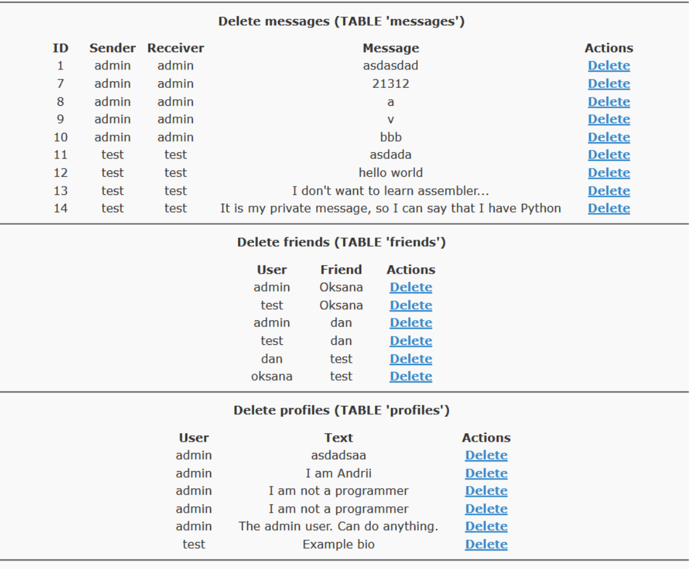

# CSM-System: Social Network "Andrii Campfire"

Not AI generated!

---

## Table of Contents

* **1. [CSM-System: Social Network "Andrii Campfire"](#csm-system-social-network-andrii-campfire)**

  * **1.1. [Intro](#intro)**

    * **1.1.1. [Description](#description)**
    * **1.1.2. [Stack of Technologies](#stack-of-technologies)**
  * **1.2. [Architecture](#arhitecture)**

    * **1.2.1. [Application Architecture](#application-arhitecture)**
    * **1.2.2. [Interaction with Database](#interaction-with-database)**
  * **1.3. [Development](#development)**

    * **1.3.1. [Project Summary](#project-summary)**

      * **1.3.1.1. [Client Side Summary](#client-side-summary)**
      * **1.3.1.2. [Server Side Summary](#server-side-summary)**
      * **1.3.1.3. [Workflow Summary](#workflow-summary)**
      * **1.3.1.4. [Project Pros](#project-pros)**
      * **1.3.1.5. [Project Cons](#project-cons)**
      * **1.3.1.6. [Possible Improvements](#possible-improvements)**
    * **1.3.2. [UI Design](#ui-design)**

      * **1.3.2.1. [Plan](#plan)**
      * **1.3.2.2. [Realization](#realization)**
    * **1.3.3. [Database](#database)**

      * **1.3.3.1. [Tables](#tables)**
      * **1.3.3.2. [Relationships](#relationships)**
      * **1.3.3.3. [General Overview](#general-overview)**
      * **1.3.3.4. [Possible Improvements](#possible-improvements-1)**
    * **1.3.4. [Repository Structure](#repository-structure)**
  * **1.4. [Class Design](#class-design)**

    * **1.4.1. [Class `Encryption`](#class-encryption)**
    * **1.4.2. [Class `Database`](#class-database)**
    * **1.4.3. [Class `Friend`](#class-friend)**
    * **1.4.4. [Class `Member`](#class-member)**
    * **1.4.5. [Class `Profile`](#class-profile)**
  * **1.5. [Testing (Manual)](#testing-manual)**

    * **1.5.1. [Registration Capability](#registration-capability)**
    * **1.5.2. [Login Capability](#login-capability)**
    * **1.5.3. [Members Section](#ability-to-view-and-interact-with-website-users-in-members-section)**
    * **1.5.4. [Friends Section](#614-display-of-established-connections-between-users-in-friends-section)**
    * **1.5.5. [Messages Section](#display-of-published-messages-in-messages-section)**
    * **1.5.6. [Admin Panel Section](#display-of-possible-administrator-actions-in-admin-panel-section)**

---


# Intro

## Description
Status: `FINISHED and ARCHIVED`

The purpose of the project is to demostrate my web knowledge and create a social network from scratch without frameworks.

## Stack of technologies

LAMP Stack (Linux, Apache, MySQL, PHP):
[](https://skillicons.dev)

# Arhitecture

## Application arhitecture


## Interaction with database


# Development

## Project summary
### Client side summary

* **HTML**: This markup language is used to create the user interface of a web application.
* **CSS**: This cascading style sheets language is used to style the user interface of a web application.
* **JavaScript**: This programming language is used to provide dynamic behavior to the user interface and handle client-side events.
* **PHP**: This programming language is used to handle user requests on the server side and interact with the database.

### Server side summary

* **PHP:** This programming language is used to handle user requests, interact with the database, and generate dynamic HTML pages.
* **MySQL:** This relational database management system is used to store user data, messages, profiles, and other web application data.

### Workflow summary

* The user interacts with the web application through the HTML interface.
* JavaScript is used to handle client-side events and send PHP requests to the server.
* PHP scripts on the server process requests, interact with the MySQL database, and generate dynamic HTML pages.
* The dynamic HTML pages are sent back to the user for display in their browser.

### Project Pros

* This architecture is simple and easy to understand.
* It is easy to expand and maintain.
* It can be implemented using widely available technologies.

### Project Cons

* This architecture may not be as scalable as other architectures.
* It may be more difficult to secure against attacks.

### Possible improvements

* Use a PHP framework, such as Laravel or Symfony, to simplify the development and maintenance of the web application.
* Protect the web application from SQL injection vulnerabilities and other security threats.
* Perform regular database backups.
* Scale the web application as it grows, if necessary.


## UI Design

### Plan

To ensure the best user experience in the early stages of development, a decision was made to create a minimalist design with a neutral color palette.

Main page:


Input buttons:


### Realization
Home page:


Login:


Friends page:


Users page:


Portfilio page:


Notifications:


Profile edit:


Admin page:




## Database

### Tables

**Table `members`:**
* `user` (VARCHAR): Unique user identifier.
* `pass` (VARCHAR): User password.

**Table `messages`:**
* `id` (INT): Unique message identifier.
* `auth` (VARCHAR): Identifier of the user who sent the message.
* `recip` (VARCHAR): Identifier of the user to whom the message is addressed.
* `pm` (CHAR): Indicates whether the message is private (`pm = 'Y'`) or public (`pm = 'N'`).
* `time` (INT): Time the message was sent.
* `message` (VARCHAR): Message text.

**Table `friends`:**
* `user` (VARCHAR): User identifier.
* `friend` (VARCHAR): User's friend identifier.

**Table `profiles`:**
* `user` (VARCHAR): User identifier.
* `text` (VARCHAR): Additional information about the user (e.g., self-description, interests).

### Relationships

* Each table is linked to the `members` table through the `user` field. This means that every record in the `messages`, `friends`, or `profiles` tables must also have a corresponding record in the `members` table.
* The `messages` table has two relationships with the `members` table:
  * `auth` links each message to the user who sent it.
  * `recip` links each message to the user to whom it is addressed.
* The `friends` table has two relationships with the `members` table:
  * `user` links each friendship record to the user.
  * `friend` links each friendship record to the user's friend.
* The `profiles` table has one relationship with the `members` table:
  * `user` links each user profile to the corresponding user.

### General Overview

* This database structure is suitable for a small social network.
* It allows storing information about users, their messages, friends, and profiles.
* The relationships between tables ensure efficient data access and processing.

### Possible Improvements

* Add a `timestamp` field to the `members` table to store the date and time of account creation.
* Add a `status` field to the `profiles` table to store the user’s status (e.g., active, inactive).
* Add indexes to the `user`, `auth`, `recip`, and `friend` fields to improve query performance.


## Repository structure

```
├───css
├───images
│   ├───icons-png
│   └───icons-svg
├───js
├───mermaind
│   └───png
├───README-assets
└───src
```
* `css` - CSS files
* `images` - all images, including icons
* `js` - JavaScript files
* `mermaind` - Diagram descriptions using Mermaind.js
  * `png` - Exports as PNG files
* `README-assets` - All assets related to this README.md file
* `src` - Class declarations


# Class design

## Class `Encryption`
Responsible for encrypting data, such as user passwords.


* Has one method: `hash(password)`, which converts a password into a hashed string.

## Class `Database`
Responsible for interacting with the database.


* Contains several properties for storing connection details, such as `host`, `user`, `pass`, etc.
* Includes methods for performing database actions, such as `createTable`, `queryMysql`, and `showProfile`.

## Class `Friend`
Responsible for managing friendships between users.


* Has properties `friend` (to store the friend’s name) and `user` (to store the user’s name).  * Methods include adding friends (`setFriend`), retrieving follower and following lists (`getFollowersByUser`, `getFollowingByUser`), and managing friendships (`insertIfExists`, `removeFriendship`).

## Class `Member`
Responsible for system users.


* Has the property `user` for storing the username.
* Methods for password handling: `getPassword`, `setPassword`.
* Methods for searching users by username and password (`findRecordByUserPassword`, `findRecordByUser`) and saving user data (`save`).

## Class `Profile`
Responsible for the user profile.


* Has properties `user` (username) and `text` (profile information).
* Method `set_text` to set the profile text.


# Testing (manual)

## Registration Capability

| № | Situation                                                            | Input Data         | Output Data                    | Test Passed |
| - | -------------------------------------------------------------------- | ------------------ | ------------------------------ | ----------- |
| 1 | User enters login and password to create their account on the server | Login and password | Record created in the database | ✅         |

---

## Login Capability

| № | Situation                                                                                                    | Input Data               | Output Data                                          | Test Passed |
| - | ------------------------------------------------------------------------------------------------------------ | ------------------------ | ---------------------------------------------------- | ----------- |
| 1 | User enters login and password to create a session, after which the user can perform actions on their behalf | Login and password       | Session created and access opened for user           | ✅         |
| 2 | User clicks “Log out” button to end the current session                                                      | “Log out” button pressed | Session ended and user returned to initial interface | ✅         |

---

## Ability to View and Interact with Website Users in “Members” Section

| № | Situation                                                                                                                    | Input Data               | Output Data                                            | Test Passed |
| - | ---------------------------------------------------------------------------------------------------------------------------- | ------------------------ | ------------------------------------------------------ | ----------- |
| 1 | User clicks the “Members” button to display all users and possible actions with them                                         | “Members” button pressed | List of all existing users                             | ✅         |
| 2 | User clicks the “follow” button to subscribe to a user and then can follow their updates                                     | “follow” button pressed  | Record of user relationship created and access granted | ✅         |
| 3 | User clicks the “recip” button to subscribe back to another user and then can follow their updates and they become “friends” | “recip” button pressed   | Record of user relationship created and access granted | ✅         |
| 4 | User clicks the “drop” button to unsubscribe from a user                                                                     | “drop” button pressed    | User relationship record deleted and access revoked    | ✅         |

---

**6.1.4. Display of Established Connections Between Users in “Friends” Section**

| № | Situation                                                                           | Input Data               | Output Data                                      | Test Passed |
| - | ----------------------------------------------------------------------------------- | ------------------------ | ------------------------------------------------ | ----------- |
| 1 | User goes to “Friends” section to see already established connections between users | “Friends” button pressed | Display of established connections between users | ✅         |

---

## Display of Published Messages in “Messages” Section

| № | Situation                                                  | Input Data                    | Output Data                                                 | Test Passed |
| - | ---------------------------------------------------------- | ----------------------------- | ----------------------------------------------------------- | ----------- |
| 1 | User goes to “Messages” section to view published messages | “Messages” button pressed     | Display of messages published by the user                   | ✅         |
| 2 | User goes to “Messages” section to publish a message       | Text and message type entered | Message added to the database and displayed with all others | ✅         |

---

## Display of Possible Administrator Actions in “Admin Panel” Section

| № | Situation                                                                                      | Input Data                                          | Output Data                                                              | Test Passed |
| - | ---------------------------------------------------------------------------------------------- | --------------------------------------------------- | ------------------------------------------------------------------------ | ----------- |
| 1 | Regular user attempts to access the administrator page and sees an access denied message       | Session created for user without admin rights       | Access denied message                                                    | ✅         |
| 2 | Administrator attempts to access the administrator page and sees the full toolset              | Session created for administrator with admin rights | Full toolset                                                             | ✅         |
| 3 | Administrator in “Admin panel” clicks “Setup” to configure all databases                       | Session created for administrator with admin rights | Database configured                                                      | ✅         |
| 4 | Administrator in “Admin panel” can view all records in the database in all tables              | Session created for administrator with admin rights | Displayed list of tables with stored data and ability to manipulate them | ✅         |
| 5 | Administrator in “Admin panel” can delete any record from any table                            | Session created for administrator with admin rights | Corresponding record deleted from the respective table                   | ✅         |
| 6 | Administrator in “Admin panel” can reset a password to a random one and provide it to the user | Session created for administrator with admin rights | Password changed to randomly generated one and displayed on the page     | ✅         |
| 7 | Administrator in “Admin panel” can add a user from the panel using login and password          | Session created for administrator with admin rights | Corresponding record about the user created in the database              | ✅         |

---

alytvynenko.net